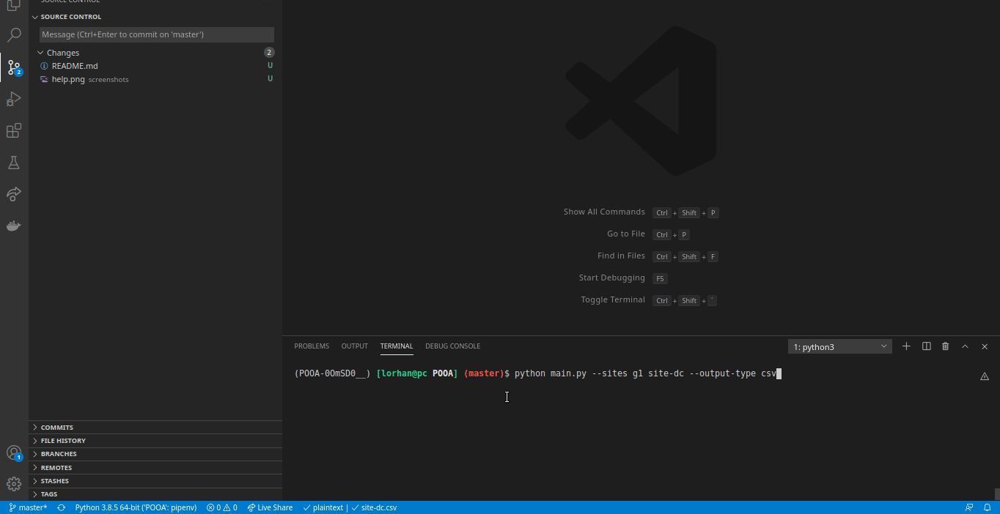
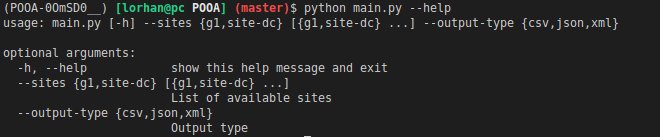

# WEB SCRAPPER
Ferramenta para extrair links de notícias




## Autores
- Lorhan Sohaky
- Lucas Martins

## Como instalar?
Para executar o projeto é necessário ter o [Python 3.8](https://www.python.org/downloads/), o [pipenv](https://pypi.org/project/pipenv/) para gerenciar as dependências do projeto e o [geckodriver (driver do Firefox)](https://www.selenium.dev/selenium/docs/api/py/index.html#drivers).

Após ter tudo instalado, será preciso adicionar o local de instalação do geckodriver no PATH do sistema. Em seguida basta executar

```sh
pipenv install
```

### Como executar o projeto?
Para entrar no ambiente virtual criado durante a instalação, basta executar:
```sh
pipenv shell
```

Caso queira ver como executar o programa, basta executar:
```sh
python main.py --help
```




Agora para extrair as notícias de um site basta escolher de qual site deseja pegar as notícias e qual o formato da saída que deseja. No exemplo abaixo são extraídas as notícias do site do DC e do G1; e o tipo de saída é o CSV.

```sh
python main.py --sites g1 site-dc --output-type csv
```

## Como extrair notícias de outros sites?
Para isso é necessário criar um novo arquivo pasta `extractors`. Por exemplo `site_que_quero_extrair.py`. Com a seguinte estrutura:

```python
from news import News
from .abstract_news_extractor import AbstractNewsExtractor

class SiteQueQueroExtrairExtractor(AbstractNewsExtractor):
    def __init__(self):
        super().__init__('https://site_que_quero_extrair.com')

    def extract_news(self):
        # Implementação da extração
```

Em seguida adicionar este novo extrator a lista de extratores disponíveis lá no arquivo `main.py`

```python
from extractors.site_que_quero_extrair import SiteQueQueroExtrairExtractor

site_options = {
    'g1': G1NewsExtractor,
    'site-dc': SiteDCNewsExtractor,
    'site-que-quero-extrair': SiteQueQueroExtrairExtractor
}
```

## Como incluir um novo writer?

Para isso é necessário criar um novo arquivo pasta `writers`. Por exemplo `txt_writer.py`. Com a seguinte estrutura:

```python
from .abstract_writer import AbstractWriter

class TxtWriter(AbstractWriter):
    def __init__(self):
        pass
    
    def write_file(self,output_filename, list_news):
        # Implementação da escrita

```

Em seguida adicionar este novo escritor a lista de escritores disponíveis lá no arquivo `main.py`

```python
from writers.txt_writer import TxtWriter

output_options = {
    'csv': CSVWriter,
    'json': JSONWriter,
    'xml': XMLWriter,
    'txt': TxtWriter
}
```

## Notas
Durante o processo de criação das interfaces dos extratores pensamos em passar para o método de extração qual tag ou classe que deveria ser buscada, mas vimos que isso tornaria todo o processo muito engessado e que não pudesse atender a todos os tipos de sites e notícias, tendo em vista que alguns site geram o html a partir de código javascript e outros possuem notícias com destaques diferentes e consequentemente estruturas diferentes. Então achamos mais vantajoso cada extrator implementar como irá pegar as notícias. E a partir dessa decisão, é possível extrair notícias de mais de uma página de um mesmo site (por exemplo sites que têm meusite.com/?page=2) e de sites que fazem a renderização no cliente (por exemplo o site do DC).